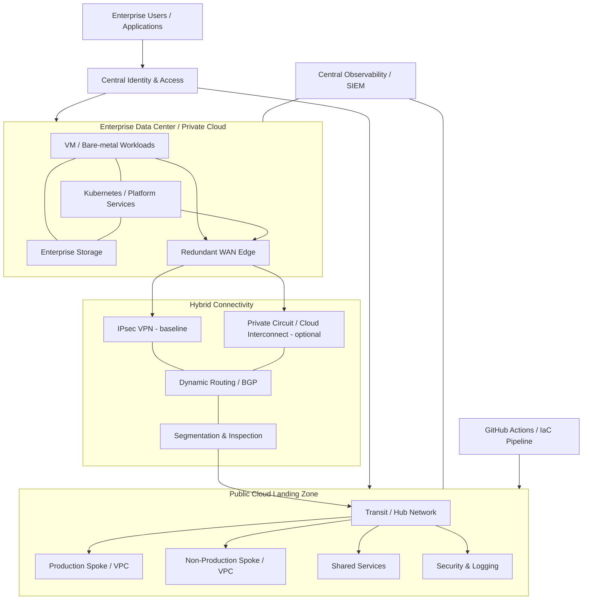

# Hybrid Cloud Reference Architecture

[](#)
[](#)
[](#)

A vendor-neutral **enterprise hybrid-cloud reference architecture** showing how an existing data center or private cloud can integrate with public-cloud landing zones while preserving consistent networking, identity, security, observability, automation, resilience and governance.

> **Scope:** This repository is a reference architecture and implementation lab. It is not presented as a customer production deployment. CIDRs, sizing, routing, controls and service selections must be validated for the target environment.

## Architecture objectives

The design is intended to demonstrate solution-architecture decisions for organizations that need to:

- retain selected workloads on-premises while adopting public cloud;
- create predictable connectivity between data-center and cloud environments;
- separate production, non-production and shared-service trust zones;
- standardize identity, logging, monitoring and security controls;
- automate repeatable infrastructure provisioning with Terraform;
- design for component, link and site failure rather than a single happy path;
- support phased workload migration without forcing an immediate full-cloud move.

## Logical architecture



The editable Mermaid source is maintained in [`diagrams/reference-architecture.mmd`](diagrams/reference-architecture.mmd).

## Design principles

| Area | Reference decision |
|---|---|
| Network | Hub-and-spoke/transit pattern with non-overlapping address space and explicit route ownership |
| Connectivity | Dual path where justified: encrypted Internet VPN plus private connectivity for critical/high-volume traffic |
| Routing | Dynamic routing preferred for scalable route exchange; filtering and summarization at trust boundaries |
| Identity | Central identity federation; least privilege; role-based access; privileged access separated from user access |
| Security | Defense in depth: segmentation, workload controls, centralized logs, encryption, secrets management and controlled egress |
| Availability | Avoid single WAN edge, firewall or cloud gateway dependencies for production-class workloads |
| Operations | Common telemetry model for metrics, logs, traces, events and audit data |
| Automation | Infrastructure changes through reviewed IaC rather than undocumented console-only changes |
| DR | Application RTO/RPO drives replication and recovery design; DR is not assumed to equal HA |

## Repository structure

```text
.
├── README.md
├── diagrams/
│   └── reference-architecture.mmd
├── docs/
│   ├── architecture-decisions.md
│   └── security-ha-dr.md
├── terraform/
│   ├── aws/
│   └── azure/
└── .github/workflows/
    └── validate.yml
```

## Implementation path

1. **Discover** existing network ranges, identity, applications, dependencies, security zones and recovery requirements.
2. **Establish the landing zone** with account/subscription separation, logging, IAM and network foundations.
3. **Build hybrid connectivity** and validate route propagation, MTU, DNS and failure behavior.
4. **Integrate shared services** such as identity, DNS, PKI, NTP, logging and security monitoring.
5. **Pilot a low-risk workload** and measure latency, availability, observability and operational processes.
6. **Scale by migration wave**, with explicit rollback and acceptance criteria.

## What to validate before production use

- IP-address overlap and route ownership
- asymmetric routing and stateful-firewall behavior
- DNS resolution across environments
- latency and bandwidth under realistic traffic profiles
- identity failure modes and break-glass access
- log retention, auditability and time synchronization
- encryption requirements in transit and at rest
- service quotas and regional dependencies
- RTO/RPO and actual recovery procedures
- infrastructure cost, data-transfer cost and operational ownership

## Related portfolio projects

- [OpenStack Private Cloud Reference Architecture](https://github.com/DeeSanas/openstack-private-cloud-reference-architecture)
- [Data Center EVPN-VXLAN Architecture](https://github.com/DeeSanas/datacenter-evpn-vxlan-architecture)
- [Terraform Enterprise Module Library](https://github.com/DeeSanas/terraform-enterprise-module-library)
- [VMware to OpenStack Migration Framework](https://github.com/DeeSanas/vmware-to-openstack-migration-framework)

## Roadmap

- [x] Reference architecture and design principles
- [x] Security / HA / DR decision framework
- [x] Starter AWS and Azure Terraform examples
- [x] CI validation workflow
- [ ] Add GCP landing-zone example
- [ ] Add automated policy/security checks
- [ ] Add failure-test scenarios and sample validation evidence

## License

Reference material and sample code are intended for learning, architecture demonstration and adaptation. Validate all configuration before use in a real environment.
