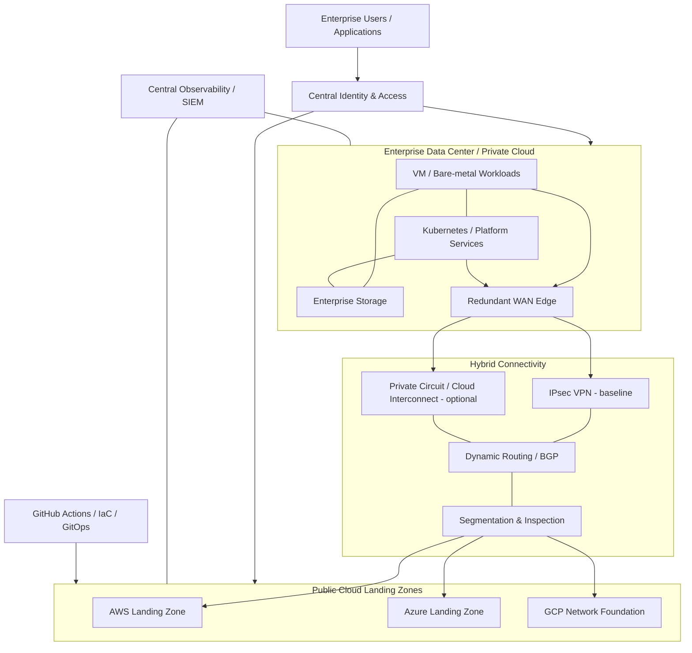

# Hybrid Cloud Reference Architecture

[](#)
[](#)
[](#)

A vendor-neutral **enterprise hybrid-cloud reference architecture** showing how an existing data center or private cloud can integrate with public-cloud landing zones while preserving consistent networking, identity, security, observability, automation, resilience and governance.

> **Scope:** This repository contains reference architectures and implementation labs. It is not presented as evidence of a customer production deployment. CIDRs, sizing, routing, controls, policies and service selections must be validated for the target environment.

## Architecture objectives

The design is intended to demonstrate solution-architecture decisions for organizations that need to:

- retain selected workloads on-premises while adopting public cloud;
- create predictable connectivity between data-center and cloud environments;
- separate production, non-production and shared-service trust zones;
- standardize identity, logging, monitoring and security controls;
- automate repeatable infrastructure provisioning and platform delivery;
- design for component, link and site failure rather than a single happy path;
- support phased workload migration without forcing an immediate full-cloud move.

## Logical architecture



The editable Mermaid source is maintained in [`diagrams/reference-architecture.mmd`](diagrams/reference-architecture.mmd).

## Design principles

| Area | Reference decision |
|---|---|
| Network | Hub/transit patterns with non-overlapping address space and explicit route ownership |
| Connectivity | Dual path where justified: encrypted Internet VPN plus private connectivity for critical/high-volume traffic |
| Routing | Dynamic routing preferred for scalable route exchange; filtering and summarization at trust boundaries |
| Identity | Central identity federation; least privilege; role-based access; privileged access separated from user access |
| Security | Defense in depth: segmentation, workload identity, centralized logs, encryption, secrets management and controlled egress |
| Availability | Avoid single WAN edge, firewall, gateway or control-plane dependencies for production-class workloads |
| Operations | Common telemetry model for metrics, logs, traces, events and audit data |
| Automation | Infrastructure changes through reviewed IaC and GitOps rather than undocumented console-only changes |
| DR | Application RTO/RPO drives replication and recovery design; DR is not assumed to equal HA |

## Repository structure

```text
.
├── README.md
├── diagrams/
├── docs/
├── terraform/
│   ├── aws/
│   └── azure/
├── projects/
│   ├── aws-enterprise-landing-zone/
│   ├── azure-enterprise-landing-zone/
│   ├── gcp-network-foundation/
│   ├── kubernetes-production-platform/
│   ├── gitops-argocd-platform/
│   ├── zero-trust-cloud-architecture/
│   └── gpu-kubernetes-platform/
└── .github/workflows/
```

## Cloud & platform reference projects

### [AWS Enterprise Landing Zone](projects/aws-enterprise-landing-zone)
Multi-account governance model covering security/logging, network/shared services, workload account separation, hybrid connectivity and a validated Terraform VPC foundation.

### [Azure Enterprise Landing Zone](projects/azure-enterprise-landing-zone)
Management-group/subscription hierarchy, hub-and-spoke networking, Entra identity, policy/monitoring governance and a Terraform hub/spoke reference.

### [GCP Network Foundation](projects/gcp-network-foundation)
Organization/folder/project hierarchy, Shared VPC, centralized hybrid routing, logging/security boundaries and a Terraform custom-network foundation.

### [Kubernetes Production Platform](projects/kubernetes-production-platform)
Highly available Kubernetes platform architecture covering control-plane resilience, dedicated worker pools, default-deny networking, resource governance, storage integration, observability, backup/restore and failure validation.

### [GitOps / Argo CD Platform](projects/gitops-argocd-platform)
Git-driven Kubernetes operating model covering Argo CD Applications/ApplicationSets, environment promotion, drift reconciliation, RBAC, secrets separation and rollback considerations.

### [Zero Trust Cloud Architecture](projects/zero-trust-cloud-architecture)
Identity-first hybrid-cloud security model covering privileged access, workload identity, segmentation, data protection, telemetry and emergency access.

### [Enterprise GPU Infrastructure](projects/gpu-kubernetes-platform)
GPU-backed Kubernetes platform design covering dedicated accelerator pools, scheduling, capacity headroom, storage/network considerations, workload placement and accelerator-aware operations.

## Implementation path

1. **Discover** existing network ranges, identity, applications, dependencies, security zones and recovery requirements.
2. **Establish cloud landing zones** with hierarchy/account/subscription/project separation, logging, IAM and network foundations.
3. **Build hybrid connectivity** and validate route propagation, MTU, DNS and failure behavior.
4. **Integrate shared services** such as identity, DNS, PKI, NTP, logging and security monitoring.
5. **Establish platform delivery** with Kubernetes and GitOps where the workload model requires it.
6. **Pilot low-risk workloads** and measure latency, availability, observability and operational processes.
7. **Scale by migration wave**, with explicit rollback and acceptance criteria.

## What to validate before production use

- IP-address overlap and route ownership
- asymmetric routing and stateful-firewall behavior
- DNS resolution across environments
- latency and bandwidth under realistic traffic profiles
- identity failure modes and break-glass access
- account/subscription/project governance ownership
- log retention, auditability and time synchronization
- encryption and key-management requirements
- cloud quotas, regional dependencies and residency
- Kubernetes/GitOps administrative boundaries
- RTO/RPO and actual recovery procedures
- infrastructure, data-transfer and operational cost ownership

## Related portfolio projects

- [OpenStack Private Cloud Reference Architecture](https://github.com/DeeSanas/openstack-private-cloud-reference-architecture)
- [Data Center EVPN-VXLAN Architecture](https://github.com/DeeSanas/datacenter-evpn-vxlan-architecture)
- [Terraform Enterprise Module Library](https://github.com/DeeSanas/terraform-enterprise-module-library)
- [VMware to OpenStack Migration Framework](https://github.com/DeeSanas/vmware-to-openstack-migration-framework)

## Roadmap

- [x] Hybrid-cloud reference architecture and decision framework
- [x] Starter AWS and Azure Terraform examples
- [x] AWS enterprise landing-zone reference project
- [x] Azure enterprise landing-zone reference project
- [x] GCP network-foundation reference project
- [x] Kubernetes production-platform reference project
- [x] GitOps / Argo CD reference project
- [x] Zero Trust guardrail reference project
- [x] GPU infrastructure and capacity-planning reference project
- [x] CI validation workflows
- [ ] Add policy-as-code examples across clouds
- [ ] Add deeper failure-test scenarios and sample validation evidence

## License

Reference material and sample code are intended for learning, architecture demonstration and adaptation. Validate all configuration before use in a real environment.
