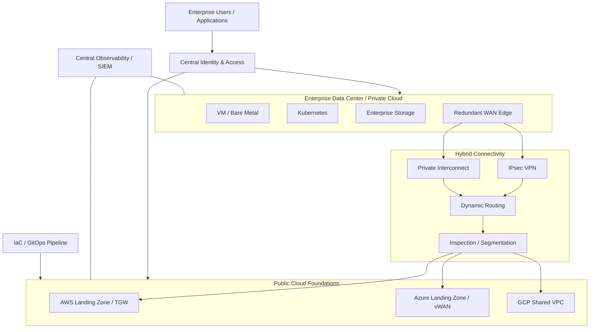

# Hybrid Cloud Reference Architecture

[](#)
[](#)
[](#)

A vendor-neutral **enterprise hybrid-cloud reference architecture** showing how data-center/private-cloud platforms integrate with AWS, Azure and GCP while maintaining consistent networking, identity, security, automation, observability, resilience and governance.

> **Scope:** This repository contains reference architectures and implementation labs. It is not evidence of a customer production deployment. CIDRs, sizing, routing, controls, policies, recovery targets and service selections must be validated for the target environment.

## Architecture objectives

- retain selected workloads on-premises while adopting public cloud;
- establish governed AWS, Azure and GCP foundations;
- design scalable transit and hybrid connectivity;
- separate production, non-production and shared-service trust zones;
- automate repeatable infrastructure and platform delivery;
- design for component, link and site failure;
- support Kubernetes, GitOps, Zero Trust and GPU/AI infrastructure;
- connect HA/DR architecture to workload-specific RTO/RPO.

## Logical architecture



## Design principles

| Area | Reference decision |
|---|---|
| Network | Hub/transit patterns with non-overlapping address space and explicit route ownership |
| Connectivity | Redundant encrypted/private paths where availability and traffic justify them |
| Routing | Dynamic routing with filtering, summarization and clear trust boundaries |
| Identity | Central federation, least privilege and separate privileged access |
| Security | Zero Trust principles, segmentation, workload identity, centralized logs and controlled egress |
| Availability | Avoid single WAN, firewall, gateway, control-plane or site dependencies for critical workloads |
| Automation | Reviewed IaC and GitOps rather than undocumented console-only changes |
| DR | Business RTO/RPO drives replication, recovery pattern and test frequency |

## Project portfolio in this repository

### Cloud foundations

- **[AWS Enterprise Landing Zone](projects/aws-enterprise-landing-zone)** — multi-account governance, security/logging separation, hybrid connectivity and Terraform foundation.
- **[Azure Enterprise Landing Zone](projects/azure-enterprise-landing-zone)** — management groups, subscriptions, hub/spoke, identity and governance.
- **[GCP Network Foundation](projects/gcp-network-foundation)** — organization/folder/project hierarchy, Shared VPC, Cloud Router and hybrid routing.

### Advanced cloud networking

- **[AWS Transit Gateway](projects/aws-transit-gateway)** — centralized VPC/hybrid routing, route-domain separation and Terraform reference.
- **[Azure Virtual WAN](projects/azure-virtual-wan)** — managed hub transit, branch/ExpressRoute connectivity, VNet attachments and Terraform reference.

### Platform engineering

- **[Kubernetes Production Platform](projects/kubernetes-production-platform)** — HA control plane, worker pools, policy, storage, backup and failure validation.
- **[GitOps / Argo CD Platform](projects/gitops-argocd-platform)** — declarative delivery, drift reconciliation, promotion and rollback.
- **[Enterprise GPU Infrastructure](projects/gpu-kubernetes-platform)** — accelerator pools, scheduling, headroom and capacity planning.

### Security & resilience

- **[Zero Trust Cloud Architecture](projects/zero-trust-cloud-architecture)** — identity-first security, segmentation, workload trust and guardrails.
- **[Dual-Data-Center HA/DR](projects/dual-datacenter-ha-dr)** — site resilience, replication, recovery tiers, failover/failback and RTO/RPO validation.

## Repository structure

```text
.
├── README.md
├── diagrams/
├── docs/
├── terraform/
├── projects/
│   ├── aws-enterprise-landing-zone/
│   ├── aws-transit-gateway/
│   ├── azure-enterprise-landing-zone/
│   ├── azure-virtual-wan/
│   ├── dual-datacenter-ha-dr/
│   ├── gcp-network-foundation/
│   ├── gitops-argocd-platform/
│   ├── gpu-kubernetes-platform/
│   ├── kubernetes-production-platform/
│   └── zero-trust-cloud-architecture/
└── .github/workflows/
```

## Implementation path

1. Discover network, identity, applications, dependencies, security zones and recovery requirements.
2. Establish cloud landing zones and governance boundaries.
3. Build hybrid/transit connectivity and validate route propagation, DNS, MTU and failover.
4. Integrate shared services such as identity, PKI, logging and security monitoring.
5. Establish Kubernetes/GitOps platform delivery where required.
6. Define HA/DR tiers and prove recovery through tests.
7. Pilot workloads and scale by migration wave with explicit rollback.

## What to validate before production use

- address overlap and route ownership;
- asymmetric routing and stateful inspection behavior;
- DNS/private endpoint resolution;
- latency, bandwidth and cloud transit cost;
- identity failure modes and break-glass access;
- account/subscription/project governance;
- encryption, key management and logging retention;
- cloud quotas and regional dependencies;
- RTO/RPO and measured recovery results;
- failback, data authority and replication resynchronization;
- operational ownership for routing, security and platform changes.

## Related portfolio projects

- [OpenStack Private Cloud Reference Architecture](https://github.com/DeeSanas/openstack-private-cloud-reference-architecture)
- [Data Center EVPN-VXLAN Architecture](https://github.com/DeeSanas/datacenter-evpn-vxlan-architecture)
- [Infrastructure Automation Library](https://github.com/DeeSanas/terraform-enterprise-module-library)
- [VMware to OpenStack Migration Framework](https://github.com/DeeSanas/vmware-to-openstack-migration-framework)

## Roadmap

- [x] Hybrid-cloud architecture and decision framework
- [x] AWS, Azure and GCP foundation projects
- [x] AWS Transit Gateway project
- [x] Azure Virtual WAN project
- [x] Kubernetes and GitOps projects
- [x] Zero Trust architecture
- [x] GPU infrastructure reference
- [x] Dual-data-center HA/DR project
- [x] CI validation workflows
- [ ] Add cross-cloud policy-as-code examples
- [ ] Add deeper failure-test evidence and cost models

## License

Reference material and sample code are intended for learning, architecture demonstration and adaptation. Validate all configuration before real-world use.
