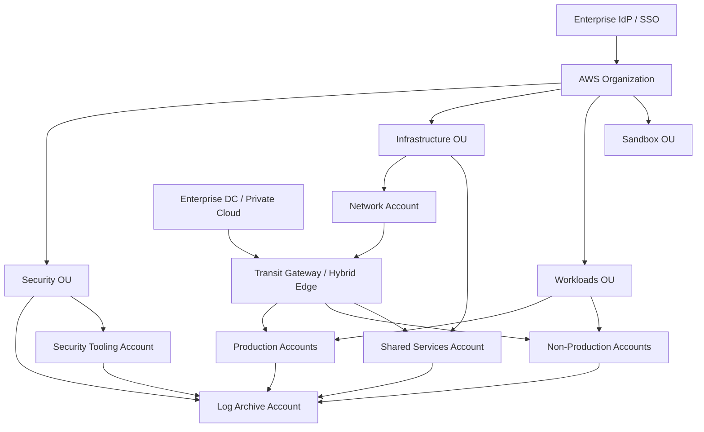

# AWS Enterprise Landing Zone

[](#)
[](#)
[](#)

A reference **AWS enterprise landing-zone architecture** for separating workloads, security, logging, shared services and network functions across multiple accounts while establishing repeatable governance from the beginning.

> This is a portfolio reference implementation, not evidence of a specific customer deployment. Organization structure, SCPs, region strategy, CIDRs, security controls and service choices must be validated against the target organization.

## Design objectives

- separate production, non-production, security and shared-services responsibilities;
- centralize audit and security telemetry;
- establish a transit-oriented network foundation;
- federate workforce identity instead of creating unmanaged long-lived IAM users;
- make account provisioning and infrastructure changes reproducible;
- preserve blast-radius boundaries between workloads;
- provide explicit controls for public exposure, encryption, backup and privileged access.

## Reference account model

```text
AWS Organization
├── Security OU
│   ├── Log Archive
│   └── Security Tooling
├── Infrastructure OU
│   ├── Network
│   └── Shared Services
├── Workloads OU
│   ├── Production
│   └── Non-Production
└── Sandbox OU
```

## Logical architecture



Editable source: [`diagrams/landing-zone.mmd`](diagrams/landing-zone.mmd).

## Governance baseline

| Control area | Reference position |
|---|---|
| Identity | Federated workforce access, MFA, role-based permissions, break-glass controls |
| Accounts | Workloads separated by environment/business boundary rather than one shared account |
| Logging | Organization-level audit/security logs centralized into protected log archive |
| Network | Central network account with controlled transit, egress and hybrid connectivity |
| Data | Encryption at rest/in transit; ownership and classification defined per workload |
| Security | Guardrails prevent high-risk configurations; detective controls feed central security operations |
| Backup | Recovery policy aligned to application RPO/RTO, not a single default for all workloads |
| IaC | Landing-zone components and workload foundations changed through reviewed code |

## Terraform reference

[`terraform/main.tf`](terraform/main.tf) creates a small, non-production VPC foundation demonstrating:

- explicit provider/version constraints;
- VPC DNS controls;
- public/private subnet separation across two AZs;
- tagging conventions;
- no automatic workload deployment;
- no credentials embedded in source.

It is intentionally a **foundation example**, not a full Control Tower replacement.

## Production validation checklist

- AWS Organizations / Control Tower operating model
- account vending and ownership process
- SCP design and exception lifecycle
- centralized CloudTrail/configuration/security telemetry
- IAM Identity Center / federation integration
- VPC and Transit Gateway route ownership
- DNS and hybrid name resolution
- egress inspection and Internet exposure controls
- KMS/key ownership and data classification
- backup vault isolation and recovery tests
- region restrictions and data residency
- budget controls, tagging and FinOps ownership

## Files

```text
aws-enterprise-landing-zone/
├── README.md
├── diagrams/landing-zone.mmd
├── docs/governance.md
└── terraform/main.tf
```
