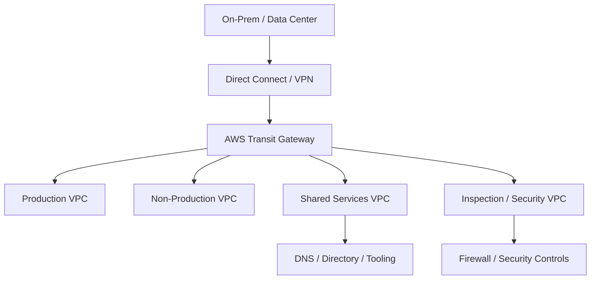

# AWS Transit Gateway Reference Architecture

A reference architecture for using **AWS Transit Gateway (TGW)** as a centralized routing hub across multiple VPCs, shared services and hybrid connectivity.

> This project is an implementation lab, not a production claim. Route-table design, inspection paths, ASN selection, attachment scale, Direct Connect/VPN topology, DNS and cost must be validated for the target organization.

## Architecture goals

- centralize connectivity without creating a full mesh of VPC peerings;
- separate production, non-production and shared-services routing domains;
- support controlled hybrid connectivity to on-premises environments;
- provide an explicit path for centralized inspection where required;
- use deterministic route ownership and avoid accidental transitive access;
- keep Terraform configuration small enough to understand during review.

## Logical design

Editable source: [`diagrams/tgw.mmd`](diagrams/tgw.mmd).

## Route-domain model

| TGW route table | Typical attachments | Intent |
|---|---|---|
| Production | production VPCs | Reach approved shared services/hybrid routes only |
| Non-Production | dev/test VPCs | Keep non-production separated from production |
| Shared Services | DNS, directory, management | Provide explicitly authorized common services |
| Inspection | security VPC | Central policy/inspection path where architecture requires it |
| Hybrid | VPN/DX gateway path | Exchange summarized enterprise routes with AWS |

## Design considerations

- Use non-overlapping VPC CIDRs and enterprise IPAM.
- Treat TGW route-table association and propagation as security-relevant configuration.
- Summarize routes where practical and avoid importing unnecessary enterprise prefixes.
- Validate symmetric routing if stateful inspection is inserted.
- Consider appliance mode for supported inspection topologies where required.
- Evaluate per-attachment and data-processing costs before centralizing high-volume traffic.
- Test route convergence and failure behavior for VPN/DX redundancy.
- Keep DNS architecture aligned with the network path; hybrid routing alone does not solve name resolution.

## Terraform reference

[`terraform/main.tf`](terraform/main.tf) creates a small lab model with:

- one Transit Gateway;
- two VPCs;
- private subnets;
- TGW VPC attachments;
- separate TGW route tables and associations.

The example deliberately omits Internet/NAT design and production inspection complexity.

## Validation checklist

1. Terraform formatting and validation pass.
2. VPC CIDRs do not overlap.
3. Attachments associate with the intended TGW route table.
4. Propagation does not create unintended prod/non-prod reachability.
5. Hybrid routes are summarized and filtered.
6. Stateful inspection remains symmetric during failure.
7. DNS works across approved trust boundaries.
8. TGW data-processing cost is understood.
