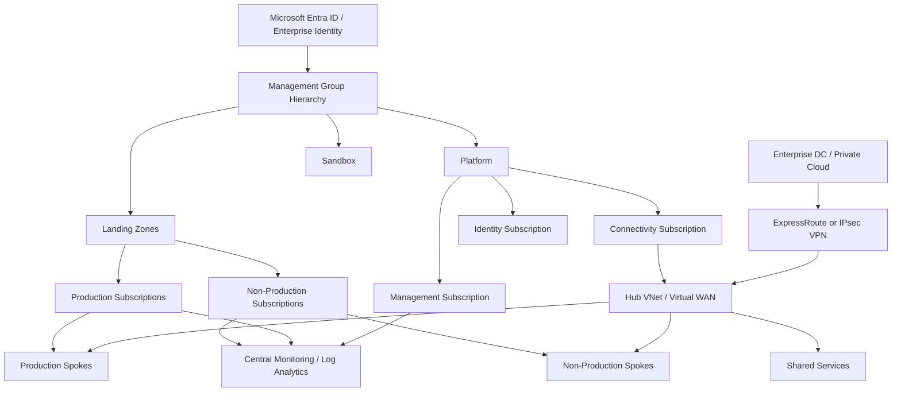

# Azure Enterprise Landing Zone

[](#)
[](#)
[](#)

A reference **Azure enterprise landing-zone architecture** covering management groups, subscription separation, governance, hub-and-spoke networking, identity, centralized monitoring and hybrid connectivity.

> This is a portfolio reference implementation. It is not a complete deployment of Microsoft's enterprise-scale architecture and is not evidence of a customer production environment. Management-group hierarchy, policies, IP plans, firewall design and regional choices must be validated for the target organization.

## Design objectives

- separate platform, connectivity, management and workload responsibilities;
- apply policy and RBAC at predictable hierarchy levels;
- use hub-and-spoke networking for shared connectivity and inspection;
- integrate enterprise identity and privileged-access controls;
- centralize activity, security and workload telemetry;
- enable hybrid connectivity without extending unmanaged trust boundaries;
- deploy repeatable foundations with Infrastructure as Code.

## Reference hierarchy

```text
Tenant Root Group
├── Platform
│   ├── Connectivity Subscription
│   ├── Management Subscription
│   └── Identity Subscription
├── Landing Zones
│   ├── Production Subscriptions
│   └── Non-Production Subscriptions
└── Sandbox
```

## Logical architecture



Editable source: [`diagrams/landing-zone.mmd`](diagrams/landing-zone.mmd).

## Governance baseline

| Control area | Reference position |
|---|---|
| Hierarchy | Management groups reflect policy and ownership boundaries |
| Identity | Entra ID federation, MFA, RBAC and privileged identity controls |
| Subscriptions | Platform services separated from application/workload subscriptions |
| Network | Central hub, controlled peering, route ownership and inspection points |
| Policy | Azure Policy used for enforceable platform guardrails and compliance evidence |
| Logging | Activity, resource and security telemetry centralized with defined retention |
| Data | Encryption, private endpoints and data-classification requirements defined by workload |
| IaC | Subscription/network foundations managed through reviewed Terraform or equivalent automation |

## Terraform reference

[`terraform/main.tf`](terraform/main.tf) provides a small hub-and-spoke foundation with:

- one resource group;
- hub VNet;
- application spoke VNet;
- bidirectional VNet peering;
- explicit address spaces and tags;
- no embedded credentials.

The example intentionally does not create production firewalling, ExpressRoute, policy assignments or private DNS because those decisions depend on the target governance model.

## Production validation checklist

- management-group and subscription ownership
- Azure Policy assignments and exemptions
- Entra ID / MFA / PIM model
- hub/spoke or Virtual WAN choice
- ExpressRoute/VPN redundancy and routing
- Azure Firewall/NVA inspection and forced tunneling
- private DNS and hybrid name resolution
- private endpoints and public-network-access restrictions
- key management and data-residency controls
- Defender/security monitoring integration
- backup vault separation and restore testing
- cost management, tagging and chargeback/showback

## Files

```text
azure-enterprise-landing-zone/
├── README.md
├── diagrams/landing-zone.mmd
├── docs/governance.md
└── terraform/main.tf
```
