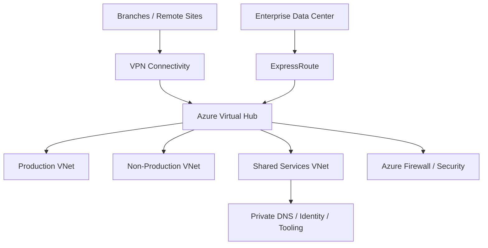

# Azure Virtual WAN Reference Architecture

A reference design for using **Azure Virtual WAN (vWAN)** as a managed global transit architecture connecting Azure VNets, branches and hybrid environments.

> This repository is a reference implementation. Hub count, region placement, secured virtual hub design, routing intent, ExpressRoute/VPN integration, firewall policy, DNS, latency and cost must be validated for the target organization.

## Architecture goals

- reduce manual hub-spoke routing complexity at multi-region scale;
- centralize branch, VPN and ExpressRoute connectivity;
- provide deterministic connectivity between application VNets and shared services;
- support centralized inspection with Azure Firewall where appropriate;
- maintain explicit separation of production and non-production routing policy;
- document the operational and cost trade-offs of managed transit.

## Logical design

Editable source: [`diagrams/vwan.mmd`](diagrams/vwan.mmd).

## Core components

| Component | Role |
|---|---|
| Virtual WAN | Global managed transit container |
| Virtual Hub | Regional transit and routing point |
| VPN Gateway | Branch/site-to-site connectivity |
| ExpressRoute Gateway | Private connectivity to enterprise networks |
| Hub VNet connections | Application/shared-service VNet attachments |
| Azure Firewall | Optional centralized traffic inspection |
| Route tables / routing intent | Control reachability and security paths |

## Architecture decisions

- Use multiple virtual hubs when geographic resilience, latency or regional scale justifies it.
- Avoid assuming every VNet should communicate with every other VNet.
- Keep DNS/private endpoint architecture synchronized with routing policy.
- Validate asymmetric routing before inserting stateful inspection.
- Treat ExpressRoute and VPN failover as an application-affecting design scenario, not only a networking feature.
- Model Virtual WAN, gateway, firewall and data-processing cost before adoption.
- Document operational ownership for hub routing and security policy changes.

## Terraform reference

[`terraform/main.tf`](terraform/main.tf) creates a compact lab foundation with:

- resource group;
- Virtual WAN;
- Virtual Hub;
- production/shared-services VNets;
- hub VNet connections.

The configuration intentionally excludes credentials, VPN sites, ExpressRoute circuits and production firewall policy.

## Validation checklist

1. Terraform formatting/validation passes.
2. Address spaces do not overlap.
3. VNet connections attach to the intended virtual hub.
4. Production/non-production routing boundaries are explicit.
5. Private DNS resolution works across approved connections.
6. VPN/ExpressRoute failure paths are tested.
7. Stateful inspection remains symmetric.
8. Multi-region latency and cost are measured before scale-out.
