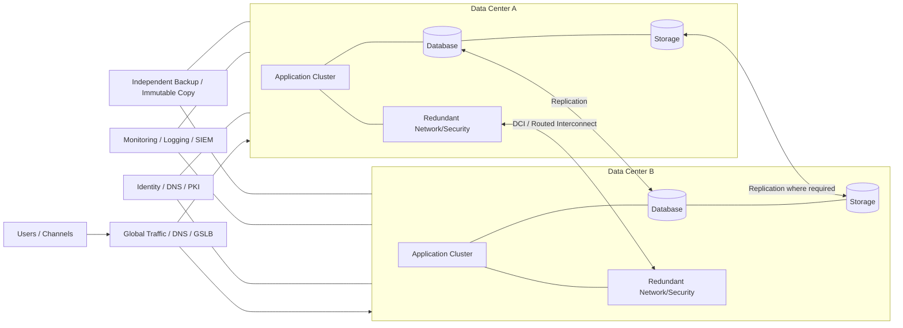

# Dual-Data-Center HA/DR Reference Architecture

A vendor-neutral reference design for operating critical enterprise services across **two data centers** while separating high availability (HA) from disaster recovery (DR).

> This is a reference architecture and engineering lab. Replication mode, latency limits, quorum design, RTO/RPO, licensing, application support and failover behavior must be validated for the actual workload.

## Objectives

- remove avoidable single-site dependencies;
- define workload-specific RTO and RPO rather than one recovery target for everything;
- keep application, database, storage, network and identity recovery dependencies visible;
- distinguish automatic HA from controlled DR failover;
- design failback and data reconciliation before a disaster occurs;
- provide deterministic recovery-tier checks that can be used during architecture review.

## Logical architecture



Editable source: [`diagrams/architecture.mmd`](diagrams/architecture.mmd).

## Recovery tiers

| Tier | Example service class | Reference RTO | Reference RPO | Typical pattern |
|---|---|---:|---:|---|
| Tier 0 | Identity / core control services | 15 min | near-zero to 15 min | active/active or tightly controlled HA |
| Tier 1 | Revenue / customer-facing critical | 1 hour | 15 min | active/standby or active/active |
| Tier 2 | Important business applications | 4 hours | 1 hour | warm standby / replicated recovery |
| Tier 3 | Standard internal workloads | 24 hours | 24 hours | restore/rebuild from backup |

These values are examples only. The business impact analysis owns the actual targets.

## Critical architecture decisions

1. **Quorum:** never stretch a quorum-based system across two sites without understanding split-brain behavior and witness requirements.
2. **Replication:** synchronous replication reduces RPO but increases latency sensitivity; asynchronous replication accepts potential data loss in exchange for distance/flexibility.
3. **Traffic management:** application failover is incomplete if DNS, load balancing, certificates, firewall policy or external routes do not move with it.
4. **Identity:** authentication, DNS, NTP, PKI and secrets are dependencies of the recovery plan, not supporting details.
5. **Backup:** replicated corruption is still corruption; maintain logically independent and preferably immutable recovery copies.
6. **Failback:** document authority of data, resynchronization and change-freeze steps before returning to the primary site.

## Validation scenarios

- single compute/node failure;
- single network/firewall path failure;
- storage component failure;
- database primary failure;
- loss of inter-site connectivity;
- complete loss of Data Center A;
- identity/DNS dependency failure;
- backup restoration into isolated recovery environment;
- failback after DR activation.

## Included artifacts

- recovery architecture diagram;
- machine-readable recovery-tier model;
- Python RTO/RPO gap checker;
- CI validation through the parent repository.

## Run the checker

```bash
python scripts/check_recovery_targets.py models/recovery-tiers.json
```

The checker validates that each tier has numeric RTO/RPO values and flags any recovery tier whose RPO exceeds its RTO.