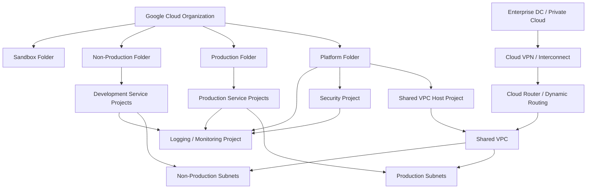

# GCP Network Foundation

[](#)
[](#)
[](#)

A reference **Google Cloud enterprise network foundation** demonstrating organization/folder/project separation, Shared VPC, centralized connectivity, logging, IAM boundaries and hybrid-cloud integration.

> This is a portfolio reference implementation. Organization policy, folder design, billing, project naming, IP allocation, service perimeters and connectivity must be validated for the target enterprise.

## Design objectives

- separate host/network projects from application service projects;
- centralize network ownership with Shared VPC;
- preserve project-level workload boundaries;
- define explicit subnet and route ownership;
- integrate hybrid connectivity through Cloud VPN or Interconnect;
- centralize selected logs/security telemetry;
- manage network foundations through Terraform.

## Reference organization model

```text
Google Cloud Organization
├── Platform Folder
│   ├── Network Host Project
│   ├── Security Project
│   └── Logging/Monitoring Project
├── Production Folder
│   ├── Production Service Project A
│   └── Production Service Project B
├── Non-Production Folder
│   └── Development/Test Projects
└── Sandbox Folder
```

## Logical architecture



Editable source: [`diagrams/network-foundation.mmd`](diagrams/network-foundation.mmd).

## Governance baseline

| Area | Reference position |
|---|---|
| Resource hierarchy | Organization → folders → projects aligned to environment and ownership |
| Network ownership | Shared VPC host project operated by platform/network team |
| Workloads | Service projects consume approved subnets without owning enterprise routing |
| Identity | Group/service-account based access with least privilege and short-lived credentials |
| Hybrid routing | Cloud Router/BGP where appropriate; prefixes filtered and documented |
| Security | Firewall policy, private service access, public exposure and egress are governed explicitly |
| Logging | Admin/activity/network/security evidence centralized according to retention requirements |
| IaC | Network and project foundations changed through reviewed automation |

## Terraform reference

[`terraform/main.tf`](terraform/main.tf) demonstrates:

- a custom-mode VPC;
- separate production and non-production subnets;
- Private Google Access on subnets;
- a Cloud Router foundation for dynamic hybrid connectivity;
- explicit labels and no embedded credentials.

The example deliberately does not create billing accounts, organization policies, IAM bindings or live VPN/Interconnect resources because those require organization-specific inputs.

## Production validation checklist

- organization/folder/project hierarchy and owners
- Shared VPC host/service project model
- IAM group and service-account lifecycle
- organization policies and exceptions
- IP allocation and overlap with on-prem networks
- firewall hierarchy and ingress/egress controls
- DNS and hybrid name resolution
- Cloud VPN/Interconnect redundancy
- route advertisements and BGP filtering
- logging sinks, retention and security operations
- KMS/key ownership and data residency
- backup/recovery and cross-region requirements
- budgets, labels and cost accountability

## Files

```text
gcp-network-foundation/
├── README.md
├── diagrams/network-foundation.mmd
├── docs/governance.md
└── terraform/main.tf
```
