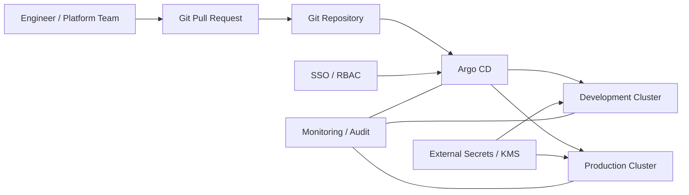

# GitOps / Argo CD Platform

[](#)
[](#)
[](#)

A reference **GitOps operating model for Kubernetes** using Argo CD concepts to keep desired state in Git, separate platform bootstrap from application delivery, and make deployment drift visible and auditable.

> This project is a reference implementation. Repository credentials, SSO, RBAC, signing, secrets, promotion rules and production synchronization policies must be adapted to the target organization.

## Design objectives

- Git is the authoritative source for declarative platform/application state;
- cluster changes are reviewed and traceable;
- Argo CD continuously compares desired and actual state;
- platform bootstrap and workload delivery remain separated;
- production synchronization can require controlled approval rather than unrestricted auto-sync;
- secrets are referenced through a secure external mechanism rather than committed in plaintext;
- rollback uses versioned Git history and tested application revisions.

## Logical architecture



## Repository model

```text
platform-gitops/
├── bootstrap/
│   └── namespaces.yaml
├── applications/
│   ├── platform-app.yaml
│   └── application-set.yaml
└── policies/
    └── promotion-model.md
```

## Reference workflow

1. Engineer proposes a change through a pull request.
2. CI validates YAML/schema/policy requirements.
3. Approved change is merged to the target branch.
4. Argo CD detects the desired-state change.
5. Non-production environments may synchronize automatically if policy allows.
6. Production synchronization follows the organization’s approval and change-control model.
7. Drift, failed syncs and health degradation are surfaced to platform operations.

## Included examples

- [`bootstrap/namespaces.yaml`](bootstrap/namespaces.yaml) — platform namespace bootstrap;
- [`applications/platform-app.yaml`](applications/platform-app.yaml) — Argo CD Application example;
- [`applications/application-set.yaml`](applications/application-set.yaml) — environment generation with an ApplicationSet;
- [`policies/promotion-model.md`](policies/promotion-model.md) — promotion and rollback decisions.

## Security considerations

- do not store cluster-admin kubeconfigs or long-lived repository tokens in Git;
- integrate SSO and least-privilege Argo CD RBAC;
- use signed commits/tags where governance requires supply-chain evidence;
- separate application deployment permissions from Argo CD administration;
- externalize secrets through a supported secret-management pattern;
- restrict which repositories and destinations a project can deploy to;
- log synchronization, administrative and RBAC events.

## Production validation checklist

- Argo CD HA topology and backup
- SSO and RBAC role mapping
- repository and cluster credential rotation
- AppProject boundaries
- sync windows and production approval model
- secrets integration
- image provenance / signing policy
- drift and orphaned-resource handling
- rollback procedure and database-change compatibility
- multi-cluster failure/recovery process
- Git repository availability and recovery

## Portfolio value

This project demonstrates that cloud-platform delivery is treated as an **operating model**—not simply `kubectl apply` commands. The focus is controlled change, repeatability, auditability and operational recovery.
